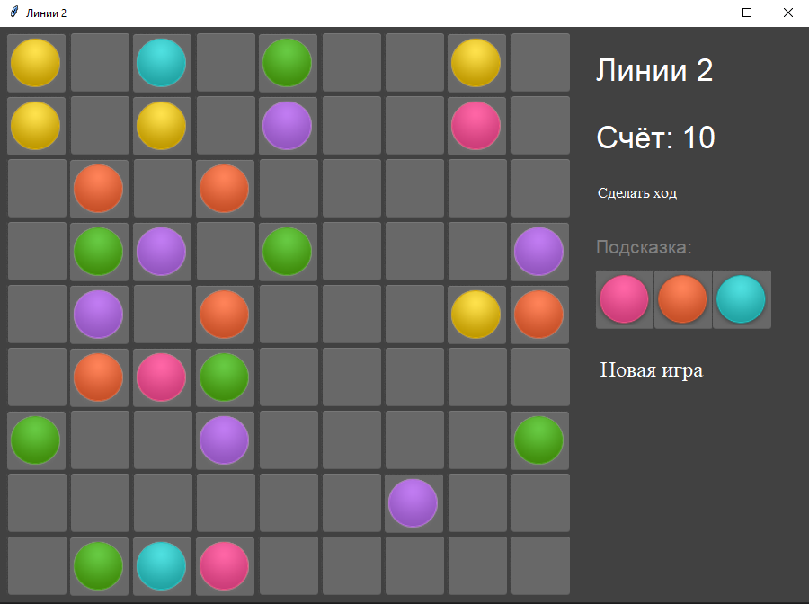

<p align="center">МИНИСТЕРСТВО НАУКИ  И ВЫСШЕГО ОБРАЗОВАНИЯ РОССИЙСКОЙ ФЕДЕРАЦИИ<br>
Федеральное государственное автономное образовательное учреждение высшего образования<br>
"КРЫМСКИЙ ФЕДЕРАЛЬНЫЙ УНИВЕРСИТЕТ им. В. И. ВЕРНАДСКОГО"<br>
ФИЗИКО-ТЕХНИЧЕСКИЙ ИНСТИТУТ<br>
Кафедра компьютерной инженерии и моделирования</p>
<br>
<h3 align="center">Отчёт по лабораторной работе № 3<br> по дисциплине "Программирование"</h3>
<br><br>
<p>студента 1 курса группы ПИ-б-о-202(2)<br>
Поливода Игоря Сергеевича<br>
направления подготовки 09.03.04 "Программная инженерия"</p>
<br><br>
<table>
<tr><td>Научный руководитель<br> старший преподаватель кафедры<br> компьютерной инженерии и моделирования</td>
<td>(оценка)</td>
<td>Чабанов В.В.</td>
</tr>
</table>
<br><br>
<p align="center">Симферополь, 2020</p>
<hr>

## Цель:
	
1. Закрепить навыки разработки программ с простым графическим интерфейсом пользователя на зыке Python при помощи библиотеки Tkinter.
2. Получить представление о разработке простых игровых приложений.

## Постановка задачи:

Используя стандартный модуль для разработки программ с графическим интерфейсом Tkinter реализовать игру Lines на зыке Python.

## Выполнение работы:

В ходе выполнения работы было извчено множество функций библиотеки Tkinter.
1. Была написана функция расположения плит. Для расположения был использовать метод place. 
2. Была написана функция для расположения шариков для плитки.
3. Далее была написана основная функция,"Перемешать шарики", которая запоминает нажатую плитку,при условии, что на ней уже находятся шарики и запоминает цвета нажатой плитки. Если нажата эта же плитка ничего не происходит, если другая плитка с шариком, то запоминается новая плитка. Если же нажата плитка без шарика, то на ее место становится плитка которую запомнили. А на место плитки которую запомнили пустая плитка.
4. Затем была написана функция, которая проверяет собраные линии.
5. Далее были созданы три функции: 
	+ Проверка горизонталей
	+ Проверка вертикалей
	+ Проверка диагоналей(библиотека numpy)
Проверка проводится по очереди. Сначала по горизонтали, затем по диагонали, далее по вертикали.
6. Еще была реализована функция поиска пути от одной точки к другой.

Вид приложения:



Рисунок 1. Интерфейс приложения.

Исходный код:

``` Python

from tkinter import *
from PIL import Image, ImageTk
import random
import os
import sys
import numpy as np

class Game:
    def __init__(self):
        self.changeFase = False
        self.use = []
        self.used = {}
        self.root = Tk()
        self.canBeVisited = []
        self.nextBalls = []
        self.hasRowCollected = [["", 0]]
        self.root.title("Линии 2")
        self.root.geometry("900x640")
        self.root.configure(background="#414141")
        self.col = 0
        self.localgem = []
        self.tileset = Image.open("image/cell-bgr.png").convert("RGBA")
        self.img_tile = ImageTk.PhotoImage(self.tileset.crop((0, 1, 67, 66)))
        self.tile_selected = (
            Image.open("image/cell-bgr.png").convert("RGBA").crop((1, 69, 67, 135))
        )
        self.img_tile_selected = ImageTk.PhotoImage(self.tileset.crop((1, 69, 67, 135)))
        self.page_bgr = Image.open("image/page-bgr.png").convert("RGBA")
        self.img_page_bgr = ImageTk.PhotoImage(self.page_bgr)
        self.colorpic = []
        self.clic = False
        self.selected_circle = 0
        b = (0, 0, 52, 52)
        zoom = (63, 62)
        self.numberfortable = {}
        self.clicked = 0
        self.clickedColor = 0
        self.row = []
        self.foundRow = False
        self.tabel = []
        self.num = []
        self.clickTo = 0
        self.placed = False
        self.rand1, self.rand2, self.rand3 = (
            random.randint(0, 6),
            random.randint(0, 6),
            random.randint(0, 6),
        )
        self.ballsPicks = {
            "pink": Image.open("image/ball-pink.png")
            .convert("RGBA")
            .crop(b)
            .resize(zoom),
            "red": Image.open("image/ball-red.png")
            .convert("RGBA")
            .crop(b)
            .resize(zoom),
            "yellow": Image.open("image/ball-yellow.png")
            .convert("RGBA")
            .crop(b)
            .resize(zoom),
            "green": Image.open("image/ball-green.png")
            .convert("RGBA")
            .crop(b)
            .resize(zoom),
            "aqua": Image.open("image/ball-aqua.png")
            .convert("RGBA")
            .crop(b)
            .resize(zoom),
            "blue": Image.open("image/ball-blue.png")
            .convert("RGBA")
            .crop(b)
            .resize(zoom),
            "violet": Image.open("image/ball-violet.png")
            .convert("RGBA")
            .crop(b)
            .resize(zoom),
            "bg": Image.open("image/cell-bgr.png").convert("RGBA"),
        }
        pic_size_same_as_bgr = Image.new("RGBA", self.tileset.size)
        pic_size_same_as_bgr.paste(self.ballsPicks["pink"], (70, 0))
        pic_size_same_as_bgr_sel = Image.new("RGBA", self.tile_selected.size)
        pic_size_same_as_bgr_sel.paste(self.ballsPicks["pink"], (70, 0))

        pp = [
            Image.alpha_composite(self.tileset, pic_size_same_as_bgr),
            Image.alpha_composite(self.tileset, pic_size_same_as_bgr),
            Image.alpha_composite(self.tileset, pic_size_same_as_bgr),
            Image.alpha_composite(self.tileset, pic_size_same_as_bgr),
            Image.alpha_composite(self.tileset, pic_size_same_as_bgr),
            Image.alpha_composite(self.tileset, pic_size_same_as_bgr),
            Image.alpha_composite(self.tileset, pic_size_same_as_bgr),
        ]
        ppchek = [
            Image.alpha_composite(self.tile_selected, pic_size_same_as_bgr_sel),
            Image.alpha_composite(self.tile_selected, pic_size_same_as_bgr_sel),
            Image.alpha_composite(self.tile_selected, pic_size_same_as_bgr_sel),
            Image.alpha_composite(self.tile_selected, pic_size_same_as_bgr_sel),
            Image.alpha_composite(self.tile_selected, pic_size_same_as_bgr_sel),
            Image.alpha_composite(self.tile_selected, pic_size_same_as_bgr_sel),
            Image.alpha_composite(self.tile_selected, pic_size_same_as_bgr_sel),
        ]
        pp[0].paste(self.ballsPicks["pink"], (0, 0), self.ballsPicks["pink"])
        pink = ImageTk.PhotoImage(pp[0].crop((1, 0, 67, 66)))

        pp[1].paste(self.ballsPicks["red"], (0, 0), self.ballsPicks["red"])
        red = ImageTk.PhotoImage(pp[1].crop((1, 0, 67, 66)))

        pp[2].paste(self.ballsPicks["yellow"], (0, 0), self.ballsPicks["yellow"])
        yellow = ImageTk.PhotoImage(pp[2].crop((1, 0, 67, 66)))

        pp[3].paste(self.ballsPicks["green"], (0, 0), self.ballsPicks["green"])
        green = ImageTk.PhotoImage(pp[3].crop((1, 0, 67, 66)))

        pp[4].paste(self.ballsPicks["aqua"], (0, 0), self.ballsPicks["aqua"])
        aqua = ImageTk.PhotoImage(pp[4].crop((1, 0, 67, 66)))

        pp[5].paste(self.ballsPicks["blue"], (0, 0), self.ballsPicks["blue"])
        blue = ImageTk.PhotoImage(pp[5].crop((1, 0, 67, 66)))

        pp[6].paste(self.ballsPicks["violet"], (0, 0), self.ballsPicks["violet"])
        violet = ImageTk.PhotoImage(pp[6].crop((1, 0, 67, 66)))

        # ckecked
        ppchek[0].paste(self.ballsPicks["pink"], (0, 0), self.ballsPicks["pink"])
        pink1 = ImageTk.PhotoImage(ppchek[0].crop((1, 0, 66, 66)))

        ppchek[1].paste(self.ballsPicks["red"], (0, 0), self.ballsPicks["red"])
        red1 = ImageTk.PhotoImage(ppchek[1].crop((1, 0, 66, 66)))

        ppchek[2].paste(self.ballsPicks["yellow"], (0, 0), self.ballsPicks["yellow"])
        yellow1 = ImageTk.PhotoImage(ppchek[2].crop((1, 0, 66, 66)))

        ppchek[3].paste(self.ballsPicks["green"], (0, 0), self.ballsPicks["green"])
        green1 = ImageTk.PhotoImage(ppchek[3].crop((1, 0, 66, 66)))

        ppchek[4].paste(self.ballsPicks["aqua"], (0, 0), self.ballsPicks["aqua"])
        aqua1 = ImageTk.PhotoImage(ppchek[4].crop((1, 0, 66, 66)))

        ppchek[5].paste(self.ballsPicks["blue"], (0, 0), self.ballsPicks["blue"])
        blue1 = ImageTk.PhotoImage(ppchek[5].crop((1, 0, 66, 66)))

        ppchek[6].paste(self.ballsPicks["violet"], (0, 0), self.ballsPicks["violet"])
        violet1 = ImageTk.PhotoImage(ppchek[6].crop((1, 0, 66, 66)))
        self.page_bgr = Image.open("image/page-bgr.png").convert("RGBA")
        self.img_page_bgr = ImageTk.PhotoImage(self.page_bgr)
        self._balls = {
            "pink": pink,
            "red": red,
            "yellow": yellow,
            "green": green,
            "aqua": aqua,
            "blue": blue,
            "violet": violet,
        }
        self._ballsSelected = {
            "pink": pink1,
            "red": red1,
            "yellow": yellow1,
            "green": green1,
            "aqua": aqua1,
            "blue": blue1,
            "violet": violet1,
        }
       
        self.colors = {
            0: "pink",
            1: "red",
            2: "yellow",
            3: "green",
            4: "aqua",
            5: "blue",
            6: "violet",
        }
        self.colorsNums = {
            "pink": 1,
            "red": 2,
            "yellow": 3,
            "green": 4,
            "aqua": 5,
            "blue": 6,
            "violet": 7,
        }

    def setperdcolor(self):
        self.rand1, self.rand2, self.rand3 = (
            random.randint(0, 6),
            random.randint(0, 6),
            random.randint(0, 6),
        )
        self.nextBalls[0].config(image=self._balls[self.colors[self.rand1]])
        self.nextBalls[1].config(image=self._balls[self.colors[self.rand2]])
        self.nextBalls[2].config(image=self._balls[self.colors[self.rand3]])

    def restore(self):
        for i in self.localgem:
            if i not in self.used:
                i.config(image=self.img_tile)

    def restoreColor(self):
        self.restore()
        for i in self.localgem:
            if i in self.used:
                self.localgem[self.localgem.index(i)].config(
                    image=self._balls[self.used[i][0]]
                )

    def creatTabel(self):
        j = 0
        for i in self.localgem:
            j += 1
            if i in self.used:
                self.row.append([i, self.colorsNums[self.used[i][0]]])
            else:
                self.row.append([i, 0])
            if j % 9 == 0:
                self.tabel.append(self.row.copy())
                self.row.clear()

    def checkForRow(self):
        self.hasRowCollected = [["", 0]]
        for j in self.tabel:
            for i in j:
                if i[1] == self.hasRowCollected[0][1] and i[1] != 0:
                    self.hasRowCollected.append([i[0], i[1]])
                    if len(self.hasRowCollected) >= 5:
                        self.foundRow = True
                        self.col += len(self.hasRowCollected) * 2
                        return
                else:
                    self.hasRowCollected.clear()
                    self.hasRowCollected.append([i[0], i[1]])

    def checkDiagonals(self):
        npar = np.array(self.tabel)
        diags = [npar[::-1, :].diagonal(i) for i in range(-8, 9)]
        diags.extend(npar.diagonal(i) for i in range(8, -9, -1))
        na = list(diags)
        for i in na:
            if len(i[1]) >= 5:
                num = 0
                for j in i[1]:
                    num += 1
                    if j == self.hasRowCollected[0][1] and j != 0:
                        self.hasRowCollected.append([i[0][num - 1], j])
                        if len(self.hasRowCollected) >= 5:
                            self.foundRow = True
                            self.col += len(self.hasRowCollected) * 2
                            return 0
                    else:
                        self.hasRowCollected.clear()
                        self.hasRowCollected.append([i[0][num - 1], j])

    def AddScore(self):
        score.config(text=self.col)

    def isSafe(self, i, j, matrix):
        if i >= 0 and i < len(matrix) and j >= 0 and j < len(matrix[0]):
            return True
        return False

    def checkForCol(self):
        a = np.array(self.tabel)
        b = [[row[i] for row in a] for i in range(9)]
        for j in b:
            for i in j:
                if i[1] == self.hasRowCollected[0][1] and i[1] != 0:
                    self.hasRowCollected.append([i[0], i[1]])
                    if len(self.hasRowCollected) >= 5:
                        self.foundRow = True
                        self.col += len(self.hasRowCollected) * 2
                        return
                else:
                    self.hasRowCollected.clear()
                    self.hasRowCollected.append([i[0], i[1]])

    def isPath(self, matrix, n=9):
        visited = [[False for x in range(n)] for y in range(n)]
        flag = False
        for i in range(n):
            for j in range(n):
                if matrix[i][j] == 1 and not visited[i][j]:
                    if self.checkPath(matrix, i, j, visited):
                        flag = True
                        break
        if flag:
            return True
        else:
            return False

    def checkPath(self, matrix, i, j, visited):
        if self.isSafe(i, j, matrix) and matrix[i][j] != 0 and not visited[i][j]:
            visited[i][j] = True
            if matrix[i][j] == 2:
                return True
            up = self.checkPath(matrix, i - 1, j, visited)
            if up:
                return True
            left = self.checkPath(matrix, i, j - 1, visited)
            if left:
                return True
            down = self.checkPath(matrix, i + 1, j, visited)
            if down:
                return True
            right = self.checkPath(matrix, i, j + 1, visited)
            if right:
                return True
        return False

    def HasAccess(self):
        mat1 = []
        a = 3
        for i in range(9):
            row1 = []
            for j in range(9):
                a = self.tabel[i][j][0]
                if self.tabel[i][j][1] == 0:
                    a = 3
                    if self.tabel[i][j][0] == self.clickTo:
                        a = 2
                    row1.append(a)
                elif self.tabel[i][j][0] == self.clicked:
                    row1.append(1)
                else:
                    row1.append(0)
            mat1.append(row1)
        if self.isPath(mat1):
            return True
        else:
            return False

    def click(self, event):
        if event.widget in self.used:
            self.clickedColor = self.used[event.widget][0]
            self.clicked = event.widget
            self.restoreColor()
            self.clicked.config(image=self._ballsSelected[self.clickedColor])
            self.selected_circle = self.used[event.widget][1]
            self.clic = True
        elif self.clic == True and event.widget != self.clicked:
            global lbl
            self.clic = not self.clic
            self.clickTo = event.widget
            self.creatTabel()
            if len(self.use) > 78:
                lbl = Label(
                    self.root,
                    text="Игра окончена",
                    font=("Arial", 16),
                    bg="#414141",
                    fg="white",
                )
                lbl.place(x=660, y=530)
                self.placed = True
                return 0
            if self.HasAccess():
                self.changeFase = True
                self.canBeVisited.clear()
                self.canBeVisited = []
                event.widget.config(image=self._balls[self.clickedColor])
                self.used.pop(self.clicked)
                self.clicked.config(image=self.img_tile)
                if (str(event.widget)[7:]) == "":
                    self.used.update({event.widget: [self.clickedColor, 0]})
                    self.use.append(0)
                else:
                    self.used.update(
                        {
                            event.widget: [
                                self.clickedColor,
                                int(str(event.widget)[7:]) - 1,
                            ]
                        }
                    )
                    self.use.append(int(str(event.widget)[7:]) - 1)
                self.use.remove(self.selected_circle)
                self.use = list(set(self.use))
            self.tabel.clear()
            self.creatTabel()
            if self.foundRow == False:
                self.checkForRow()
            if self.foundRow == False:
                self.checkDiagonals()
            if self.foundRow == False:
                self.checkForCol()
            if self.foundRow == False:
                self.tabel.clear()
            if self.foundRow == True:
                self.tabel.clear()
                self.AddScore()
                self.foundRow = False
                for i in self.hasRowCollected:
                    i[0].config(image=self.img_tile)
                    del self.used[i[0]]
                    self.use.remove(self.numberfortable[i[0]])
                self.hasRowCollected.clear()
                self.hasRowCollected.append(["", 0])
                return 0
            if self.changeFase:
                self.changeFase = False
                self.RandomPlaceColor()
        else:
            self.restore()
            event.widget.config(image=self.img_tile_selected)

    def placebgr(self):
        for i in range(14):
            for j in range(9):
                can = Canvas(self.root, height=100, width=100)
                can.create_image((70, 70), image=self.img_page_bgr)
                can.place(x=40 * i, y=40 * j)

    def restartGame(self):
        if self.placed == True:
            lbl.destroy()
            self.placed = False
        for i in self.localgem:
            i.config(image=self.img_tile)
        self.used = {}
        self.use.clear()
        self.RandomPlaceColor()
        self.col = 0
        self.AddScore()

    def set_color(self, event):
        for i in self.localgem:
            if str(i) == str(event.widget):
                i.config(image=self._balls["pink"])

    def Place(self):
        global score
        
        for i in range(9):
            for j in range(9):
                lbl = Label(self.root, image=self.img_tile, borderwidth=0)
                lbl.bind("<Button-1>", self.click)
                lbl.place(x=7 + (j * 70), y=(70 * i) + 7)
                self.localgem.append(lbl)
        
        lbl_name = Label(
            self.root, text="Линии 2", font=("Arial", 26), bg="#414141", fg="white"
        )
        lbl_name.place(x=660, y=25)
        lbl_score = Label(
            self.root, text="Счёт: ", font=("Arial", 26), bg="#414141", fg="white"
        )
        lbl_score.place(x=660, y=100)
        lbl_help = Label(
            self.root, text="Подсказка:", font=("Arial", 16), bg="#414141", fg="grey"
        )
        lbl_help.place(x=660, y=230)
        score = Label(
            self.root, text=self.col, font=("Arial", 26), bg="#414141", fg="white"
        )
        score.place(x=755, y=100)
        makeTurn = Button(
            self.root,
            bg="#414141",
            bd=0,
            fg="white",
            text="Сделать ход",
            font=("Times new Roman", 13),
            command=lambda: self.RandomPlaceColor(),
        )
        makeTurn.place(x=660, y=170)
        newGame = Button(
            self.root,
            bg="#414141",
            bd=0,
            fg="white",
            text="Новая игра",
            font=("Times new Roman", 18),
            command=lambda: self.restartGame(),
        )
        newGame.place(x=660, y=360)
        for i in range(len(self.localgem)):
            self.numberfortable.update({self.localgem[i]: i})
        for i in range(3):
            lblpod = Label(self.root, borderwidth=0, bg="#414141", fg="white")
            lblpod.place(x=662 + (65.1 * i), y=270)
            self.nextBalls.append(lblpod)
        self.setperdcolor()

    def RandomPlaceColor(self):
        global lbl
        rand11, rand22, rand33 = (
            random.randint(0, 80),
            random.randint(0, 80),
            random.randint(0, 80),
        )
        if len(self.use) > 78:
            lbl = Label(
                self.root,
                text="Игра окончена",
                font=("Arial", 16),
                bg="#414141",
                fg="white",
            )
            lbl.place(x=660, y=530)
            self.placed = True
            return 0
        if self.placed:
            lbl.destroy()
            self.placed = False
        while True:
            found = 1
            rand11, rand22, rand33 = (
                random.randint(0, 80),
                random.randint(0, 80),
                random.randint(0, 80),
            )
            j = len(self.use)
            for i in self.use:
                if (
                    i == rand11
                    or i == rand22
                    or i == rand33
                    or rand11 == rand22
                    or rand11 == rand33
                    or rand22 == rand33
                ):
                    found = 2
                    break
                else:
                    j -= 1
                if j == 0:
                    break
            if found == 1:
                break

        self.use.append(rand11)
        self.use.append(rand22)
        self.use.append(rand33)
        self.use = list(set(self.use))
        self.localgem[rand11].config(image=self._balls[self.colors[self.rand1]])
        self.localgem[rand22].config(image=self._balls[self.colors[self.rand2]])
        self.localgem[rand33].config(image=self._balls[self.colors[self.rand3]])
        self.used.update({self.localgem[rand11]: [self.colors[self.rand1], rand11]})
        self.used.update({self.localgem[rand22]: [self.colors[self.rand2], rand22]})
        self.used.update({self.localgem[rand33]: [self.colors[self.rand3], rand33]})
        self.setperdcolor()
        self.creatTabel()
        if self.foundRow == False:
            self.checkForRow()
        if self.foundRow == False:
            self.checkDiagonals()
        if self.foundRow == False:
            self.checkForCol()
        if self.foundRow == False:
            self.tabel.clear()
        if self.foundRow == True:
            self.tabel.clear()
            self.AddScore()
            self.foundRow = False
            for i in self.hasRowCollected:
                i[0].config(image=self.img_tile)
                del self.used[i[0]]
                self.use.remove(self.numberfortable[i[0]])
            self.hasRowCollected.clear()
            self.hasRowCollected.append(["", 0])
            return 0
        self.tabel.clear()


p = Game()
p.Place()
p.RandomPlaceColor()
p.root.mainloop()

```

## Вывод

В ходе выполнения лабораторной работы я улучшил свои знания в работе с Tkinter. С помощью этих знаний написал простейшее графическое приложение. Выполнил поставленные задачи.